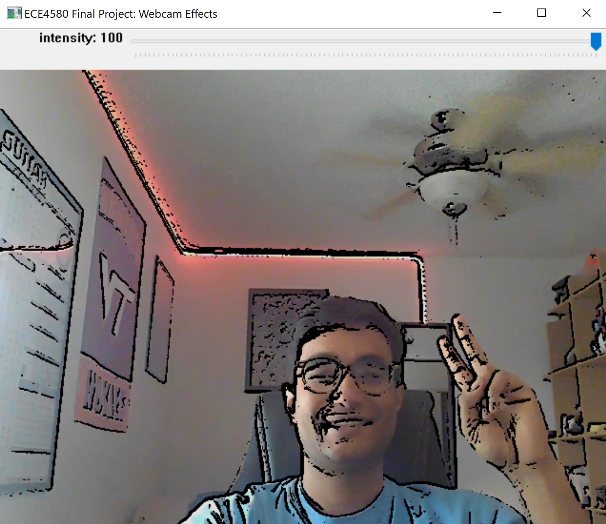

# ECE 4580 Final Project: Live Webcam Effects Processor

This is my implementation for the final project for the class "ECE 4580: Computer Vision ", which I took at Virginia Tech during the Fall of 2021.

It is a simple effects processor for an incoming stream of webcam frames. The processed frames are displayed on a simple gui, with adjustable user elements. The algorithm that produces the 'cartoonizer' effect (currently the only implemented effect) was created from scratch -- emphasis was placed on algorithmic speed and was the primary focus of this project. On my machine I currently achieve a frame rate of above 1FPS, which is substantially less than my previous implementations in this class which achieved latencies of well over 20 seconds, even in the frequency domain.

The structure of this code base abstracts away details between effects processing algorithms and gui interfacing, allowing for easy code reuse as well and feature expandability (e.g. new effects). Features such as image capture-and-save as well as mode switching have been programmed in, but the GUI buttons require compilation of QT with openCV, which is cumbersome and unnecessary for the initial submission of this project. The commented out section regarding this can be found in 'code\gui\gui.py'.

The only packages needed are cv2 and numpy. Simply run 'pip install opencv-python numpy'. This code base was tested on Python 3.9.7 on Windows.

The image below is a screenshot of the program running on my machine.

    

